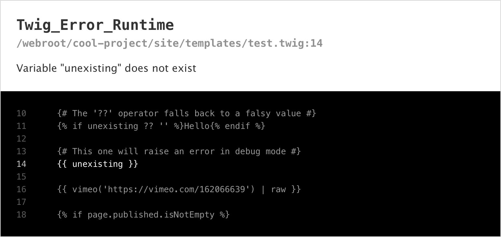

# Twig Plugin for Kirby CMS

-   Adds support for [Twig templates](http://twig.sensiolabs.org/) to [Kirby CMS](https://getkirby.com/).
-   Requires Kirby 2.3 (in beta as of 2016-04-12).

> I don’t like Twig!

It’s okay, using this plugin is of course optional. You can keep using PHP templates in Kirby CMS.

> I like Twig, but I don’t want to convert all my templates

Good news: you don’t have to! By default your PHP templates will keep working.

This plugin can work in two modes:

1. Default: allow both Twig and PHP templates. (If both `mytemplate.twig` and `mytemplate.php` exist, the Twig template takes precedence.)
2. Optional: allow Twig templates only.


## Installation

You will need [Composer](https://getcomposer.org/), a command-line tool, to install this plugin.

1. Download a copy of this repository and put it in your `site/plugins` folder. Rename the copied folder to `twig`.
2. Open a terminal in your `site/plugins/twig` folder and run `composer install`.
3. To activate the plugin, put `c::set('plugin.twig.enabled', true);` in your `config.php`.

You can now create `.twig` templates in your `site/templates` directory.


## Using Twig

See [Twig templating tips for Kirby](doc/templating.md).


## How errors are managed

With PHP templates, most errors are shown directly in the page. Things are a bit different with Twig: if an error is not suppressed, the template will *not* be rendered at all, and you end up with an error page.

Here is how this plugin manages templating errors:

### In production (`c::get('debug') == false`)

-   Undefined variables and methods are ignored, so they don’t raise an error.
-   For other errors, an error page will be shown, and it will have very little information about the source of the error (it doesn’t mention Twig, template names, etc.).
-   We will show the error page (`c::get('error')`) if it exists, or a very short message otherwise.

### In debug mode (`c::get('debug') == true`)

-   Undefined variables and methods raise an error (see the config section if you want to change that).
-   A nice error page is shown, with an excerpt of the faulty template code.




## Options

```php
// REQUIRED: activate Twig plugin
c::set('plugin.twig.enabled', true);

// Should we use .php templates as fallback when .twig
// templates don't exist? Set to false to only allow Twig templates
c::set('plugin.twig.usephp', true);

// Use Twig’s PHP cache?
// (Note that Kirby has its own HTML cache.)
c::set('plugin.twig.cache', false);

// Should Twig throw errors when using undefined variables or methods?
// Defaults to the value of the 'debug' option
c::set('plugin.twig.strict', c::get('debug', false));

// Disable or specify autoescaping type
// http://twig.sensiolabs.org/doc/api.html#environment-options
c::set('plugin.twig.autoescape', true);
```


## Known limitations

1.  Only a subset of Kirby’s functions and helpers are exposed to Twig templates. The `$page`, `$pages` and `$site` objects are available (as `page`, `pages` and `site`), but only a fraction of Kirby’s many helper functions are. See [doc/templating.md](doc/templating.md) for more info.

2.  Likewise, normal PHP functions are not available to Twig templates. If you want full PHP power, use PHP templates, or write [Controllers that send data to your templates](https://getkirby.com/docs/templates/controllers). Note that Twig already gives you a lot of tools for working with strings and arrays: [Twig Reference](http://twig.sensiolabs.org/documentation#reference).

3.  By design, Twig will *not* let you include files from outside the `site/templates` directory. If you have a use case where this is a problem, please open an issue.
